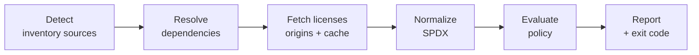

# PRD — licguard, a license compliance CLI

Status: draft v2 · 2026-09-28

Terms in **bold** are defined in [CONTEXT.md](../CONTEXT.md). Structural decisions are recorded in [docs/adr/](adr/).

## Problem

Software projects ship hundreds of open source dependencies, most of them transitive, and nobody checks their licenses systematically. A dependency under an incompatible license (GPL in distributed software, AGPL in a SaaS, no license at all) creates legal and contractual risk that is usually discovered late — during an audit or due diligence — when removing it is expensive.

licguard is a public, organization-neutral open source CLI written in Rust ([ADR-0003](adr/0003-public-open-source-tool.md)). It inventories a **Project**'s dependencies, normalizes their licenses to SPDX, and evaluates them against the **Policy** the Project declares. It runs locally first, then in CI as a blocking gate.

## Goals and non-goals

The goal: no **Violation** reaches a Project's main branch unless it is covered by a **Waiver**.

**Goals**

- Inventory every direct and transitive dependency of an npm Project, then of Java Projects.
- Give every **Package** a **Normalized license** (SPDX expression).
- Evaluate each Package against the Policy and give it a **Verdict** with a **Verdict reason**.
- Produce output that is readable locally and actionable in CI (exit codes, JSON, GitHub annotations, SARIF).
- Let Project owners correct wrong metadata (**License clarifications**) and tolerate specific violations (**Waivers**) in a traceable, dated way.

**Non-goals**

- Legal advice. The Policy belongs to each user; licguard ships a neutral template and says so.
- Security vulnerability detection (CVEs).
- Snippet scanning of source code.
- Attribution / NOTICE file generation (candidate for later).
- A baseline mode ([ADR-0001](adr/0001-no-baseline-waivers-only.md)).

**Success indicators**

| Indicator | Target |
| --- | --- |
| Packages with a resolved license, on a corpus of real-world lockfiles | ≥ 98 % |
| CI run time, warm cache, ~1,500 dependencies | < 30 s |
| False positives reported by users | < 2 % of Violations |

## Users and use cases

| Profile | Need | Main usage |
| --- | --- | --- |
| Developer (primary MVP target) | Know before pushing whether a new dependency is a problem | `licguard check` locally |
| Tech lead / DevOps | Block forbidden licenses automatically | GitHub Action as a gate |
| Legal / compliance | Get a Project's full license inventory for a customer or an audit | `licguard list --format json` |

**Priority use cases**

1. A developer adds an npm package, runs `licguard check` and immediately sees it is `AGPL-3.0-only`.
2. A pull request introduces a forbidden transitive dependency: the job fails, naming the Package and its **Introduction path**, with an annotation on the lockfile.
3. Legal approves an LGPL package: a Waiver is added to `licguard.toml` with a reason and an expiry date.
4. A package has no license metadata but its repository is MIT: a License clarification records the real license and its evidence.
5. Before a delivery, the project lead exports the full inventory grouped by license.

## Priority scale

**P0** = MVP, **P1** = v1.0, **P2** = later.

## Ecosystems

| Priority | Ecosystem | Inventory sources | License origins |
| --- | --- | --- | --- |
| P0 | npm | `package-lock.json` v2/v3, `yarn.lock` (v1 and Berry), `pnpm-lock.yaml` | installed package, lockfile, npm registry |
| P1 | Java (Maven, Gradle) | CycloneDX JSON SBOM from the official plugins; `mvn dependency:tree` / Gradle `dependencies` as fallback | POM `<licenses>`, Maven Central |
| P2 | Composer, pip, Cargo | Native lockfiles or SBOM | Respective registries, deps.dev |

npm lockfiles contain the full tree and dev markers, so they are parsed natively without running npm. The `license` field is sometimes missing, legacy (`licenses` array) or not SPDX.

Maven and Gradle have no reliable standard lockfile; licguard never reimplements their dependency mediation and relies on CycloneDX SBOMs first. Java licenses are often expressed by name and URL ("The Apache Software License, Version 2.0") and need a mapping table to SPDX. Java scopes `test` and `provided` map to the `dev` **Scope**.

## Functional requirements

| ID | Requirement | Priority |
| --- | --- | --- |
| F-01 | Detect **Inventory sources** at the Project root and in subdirectories; treat npm workspaces as **Workspace members** | P0 |
| F-02 | Parse `package-lock.json` v2/v3: name, version, Scope, Introduction paths | P0 |
| F-03 | Resolve licenses through **License origins** in priority order (see below) | P0 |
| F-04 | Normalize **Declared licenses** to SPDX expressions, including legacy forms and common aliases | P0 |
| F-05 | Evaluate SPDX expressions (`OR`, `AND`, `WITH`) against the Policy (see rules below) | P0 |
| F-06 | Give each Package a Verdict (`allow`, `review`, `deny`) and a Verdict reason (`listed`, `unresolved`, `unlisted`, `waived`) | P0 |
| F-07 | Display the inventory sorted by license or by Verdict | P0 |
| F-08 | Deterministic exit code | P0 |
| F-09 | Exclude `dev` Dependencies by default, with an option to include them | P0 |
| F-10 | Waivers per package (optional version) with mandatory reason and expiry date | P0 |
| F-11 | Local cache of resolved license metadata per Package | P0 |
| F-12 | Parse `yarn.lock` (v1, Berry) and `pnpm-lock.yaml` | P0 |
| F-13 | JSON export of the full inventory | P0 |
| F-14 | License clarifications with evidence | P0 |
| F-15 | Waiver lifecycle warnings: expiring soon, expired, unmatched; unmatched clarifications | P0 |
| F-16 | `licguard waive` generates Waivers from current Violations | P0 |
| F-17 | GitHub output: annotations and job summary | P0 |
| F-18 | Import a CycloneDX JSON SBOM as an Inventory source | P1 |
| F-19 | Maven and Gradle support via SBOM, with build-tool fallback | P1 |
| F-20 | Java license name/URL → SPDX mapping table | P1 |
| F-21 | SARIF output (GitHub Code Scanning) | P1 |
| F-22 | CSV export | P1 |
| F-23 | Diff mode: check only Dependencies changed against a git ref | P1 |
| F-24 | deps.dev / ClearlyDefined fallback when the registry has nothing | P1 |
| F-25 | Central shared Policy (URL or path) overridden by the Project Policy, with **Distribution models** | P1 |
| F-26 | `licguard explain <PACKAGE>` | P1 |
| F-27 | License detection from LICENSE file text | P2 |
| F-28 | NOTICE / attribution generation | P2 |
| F-29 | Composer, pip, Cargo | P2 |
| F-30 | Other CI platforms (e.g. GitLab Code Quality report) | P2 |

## Policy

The Policy lives in a versioned `licguard.toml` at the Project root. `licguard init` writes the neutral template below; its comments tell users to have it validated by their own legal counsel.

```toml
[policy]
allow   = ["MIT", "Apache-2.0", "BSD-2-Clause", "BSD-3-Clause", "ISC", "0BSD", "Unlicense", "CC0-1.0"]
review  = ["MPL-2.0", "LGPL-2.1-only", "LGPL-3.0-only", "EPL-2.0", "CDDL-1.0"]
deny    = ["GPL-2.0-only", "GPL-3.0-only", "AGPL-3.0-only", "SSPL-1.0", "BUSL-1.1"]
unresolved = "deny"        # no license found, or not normalizable to SPDX
unlisted   = "review"      # valid SPDX, but in none of the lists above
include_dev = false
waiver_expiry_warning_days = 30

[[clarifications]]
package  = "legacy-utils"
version  = "0.0.4"         # optional: all versions if absent
license  = "MIT"
evidence = "https://github.com/example/legacy-utils/blob/v0.0.4/LICENSE"

[[waivers]]
package = "some-lib"
version = "2.1.0"          # optional: all versions if absent
license = "LGPL-3.0-only"  # Normalized license the Waiver applies to
reason  = "Approved by legal, ticket LEGAL-142"
expires = "2027-01-01"
```

**Evaluation rules**

- A License clarification replaces the Declared license; the Policy then evaluates it like any other license.
- `A OR B`: the Verdict is the most favorable option's; that option is the **Elected license**. Ties go to the first option in expression order.
- `A AND B`: the Verdict is the most severe of both.
- `A WITH exception`: if the full expression is listed, that entry applies; otherwise the base license's Verdict applies. An **SPDX exception** only adds permissions, so the base Verdict is a safe bound.
- `-or-later` licenses follow their base version's list unless listed explicitly.
- The same license in two lists is a configuration error (exit 2).
- A Waiver turns the Verdict into `allow` with reason `waived`, only while it matches the Package and its Normalized license. It never changes the license.
- `--strict` makes `review` Verdicts Violations.

**Waiver lifecycle** (all reported as **Warnings**, which never fail the gate)

| State | Effect |
| --- | --- |
| Active | Verdict `allow (waived)` |
| Expiring (within `waiver_expiry_warning_days`) | Still active; Warning |
| Expired | No longer applies: the original Violation comes back; Warning |
| Unmatched (package removed, version or license changed) | Applies to nothing; Warning |

Expired and unmatched Waivers are **Stale waivers**. A License clarification that matches no Package also yields a Warning.

## License origins

In priority order:

1. License clarification.
2. Installed package (`node_modules`), **only if its version matches the Inventory source exactly**; a mismatching copy is skipped (Warning in `--verbose`: "run `npm install`").
3. The Inventory source itself, when it records licenses (npm v2/v3 lockfiles copy each entry's `license` from the registry at install time).
4. Cache.
5. Registry.

The first origin that declares a license wins, even if that Declared license later turns out Unresolved. The Inventory source is the single source of truth for which Packages exist; installed packages only supply metadata. Because lockfiles record licenses, `check` works on a fresh clone without `npm install`, and optional packages for other platforms (e.g. `@esbuild/linux-x64` on macOS), which are never installed locally, still get their license. With `--offline`, a Package that no local origin can resolve is Unresolved (Verdict per `unresolved`). Without `--offline`, an unreachable registry with no cache entry is a runtime error (exit 2).

## CLI

| Command | Role | Priority |
| --- | --- | --- |
| `licguard check [PATH]` | Is the gate passing? Reports Violations and Warnings, sets the exit code | P0 |
| `licguard list [PATH]` | What is inside? The full inventory with licenses, Verdicts and origins; exits 0 unless a runtime error occurs | P0 |
| `licguard init` | Writes the neutral template `licguard.toml` | P0 |
| `licguard waive --all-violations --reason <TEXT> --expires <DATE>` | Appends Waivers for current Violations; `--reason` and `--expires` are mandatory | P0 |
| `licguard explain <PACKAGE>` | Declared license, Normalized license, License origin, Introduction paths | P1 |

**Formats**

| Command | P0 | P1 |
| --- | --- | --- |
| `check --format` | `text`, `json`, `github` | `sarif` |
| `list --format` | `table`, `json` | `csv` |

**Main options**: `--config <FILE>`, `--output <FILE>`, `--include-dev`, `--strict`, `--offline`, `--refresh`, `--cache-dir <DIR>`, `--group-by license|verdict` (`list`), `--ecosystem npm,maven`, `--quiet`, `--verbose`, `--diff <GIT_REF>` (P1).

**Exit codes**

| Code | Meaning |
| --- | --- |
| 0 | No Violation |
| 1 | At least one Violation |
| 2 | Runtime error: unreadable Inventory source, invalid configuration, registry unreachable without cache and without `--offline` |

**Example terminal output**

```text
licguard 0.1.0 — 1,243 packages (npm), 18 distinct licenses

DENY    AGPL-3.0-only   some-pdf-lib@3.2.1    via app > report-kit > some-pdf-lib
DENY    (unresolved)    legacy-utils@0.0.4    via app > legacy-utils
REVIEW  MPL-2.0         lightningcss@1.25.0   via app > vite > lightningcss

warning: waiver for some-lib@2.1.0 expires in 12 days (2026-10-10)

2 deny · 1 review · 1,240 allow
✗ Policy violated (exit 1)
```

## Non-functional requirements

| ID | Requirement | Priority |
| --- | --- | --- |
| NF-01 | Single static binary for Linux x86_64/arm64, macOS arm64/x86_64, Windows x86_64 | P0 |
| NF-02 | < 30 s for ~1,500 dependencies with a warm cache; < 2 min cold | P0 |
| NF-03 | Deterministic results: same input, same output, stable sort order | P0 |
| NF-04 | Works offline with `--offline` when the lockfile, the cache or installed packages suffice | P0 |
| NF-05 | Bounded concurrent network requests (e.g. 16) with retry and backoff | P0 |
| NF-06 | Corporate proxies and private registries (`.npmrc`, `settings.xml`) | P1 |
| NF-07 | No project data sent anywhere but the registries queried; no telemetry | P0 |
| NF-08 | Actionable error messages: file, package, cause, suggested fix | P0 |
| NF-09 | ≥ 80 % test coverage on parsing and the policy engine, with real-world lockfile fixtures | P0 |
| NF-10 | Cache in the user's standard cache directory, overridable with `--cache-dir` / `LICGUARD_CACHE_DIR`; entries never expire (published versions are immutable), `--refresh` forces a reload; Waivers and clarifications are never cached | P0 |

## Architecture

A linear pipeline:



- The MVP is **a single crate** `licguard` with internal modules (`inventory/npm`, `license`, `policy`, `report`). No library API is published.
- An `Ecosystem` abstraction is extracted at M3, when the CycloneDX SBOM gives a second real implementation. The crate is split into a workspace only if an actual need appears (e.g. using the policy engine as a library).
- Verdicts are computed per Package; Scope only decides inclusion.

**Candidate crates**

| Need | Crate |
| --- | --- |
| CLI arguments | `clap` (derive) |
| Serialization | `serde`, `serde_json`, `toml`, `serde_yaml` |
| SPDX expressions | `spdx` |
| Text detection (P2) | `askalono` |
| Concurrent HTTP | `reqwest`, `tokio` |
| POM / SBOM XML (P1) | `quick-xml` |
| Terminal rendering | `comfy-table`, `owo-colors` |
| Errors | `miette`, or `anyhow` + `thiserror` |
| Release | `cargo-dist` |

## CI and distribution

GitHub is the first-class CI platform.

| Phase | CI behavior |
| --- | --- |
| 1. Observation | Non-blocking job (`continue-on-error: true`); the report lists the Violations to fix or waive |
| 2. Gate | Blocking on the main branch and pull requests; `review` is non-blocking unless `--strict` |

Moving from phase 1 to phase 2 means fixing each Violation or covering it with a Waiver (`licguard waive`).

```yaml
# Example GitHub Actions job (P0)
license-check:
  runs-on: ubuntu-latest
  steps:
    - uses: actions/checkout@v4
    - uses: baotista/licguard@v0        # installs licguard and restores its cache
    - run: licguard check --format github
```

`--format github` emits annotations (visible on the lockfile in the pull request diff) and a Markdown job summary. SARIF upload to Code Scanning (P1) needs a public repository or GitHub Advanced Security.

**Distribution**: GitHub Releases (via `cargo-dist`), crates.io, Homebrew, a public container image (`ghcr.io/baotista/licguard`), and a GitHub Marketplace action published from this repository (`baotista/licguard`).

## Roadmap

| Milestone | Content | Requirements |
| --- | --- | --- |
| M1 — npm MVP, local | `package-lock.json`, origins and cache, SPDX, Policy, Waivers, clarifications, `check` / `list` / `init` / `waive`, `text` / `table` / `json` | F-01 to F-11, F-13 to F-16; NF-01 to NF-05, NF-07 to NF-10 |
| M2 — npm complete + GitHub | yarn and pnpm, `--format github`, GitHub Action, public release channels | F-12, F-17 |
| M3 — Java | CycloneDX SBOM, Maven, Gradle, Java license mapping, `Ecosystem` extraction | F-18 to F-20 |
| M4 — v1.0 | SARIF, CSV, diff mode, deps.dev fallback, central Policy with Distribution models, `explain`, private registries | F-21 to F-26, NF-06 |
| Later | Text detection, NOTICE, other ecosystems, other CI platforms | F-27 to F-30 |

P0 is complete at the end of M2. Each milestone ends with a pilot on one or two real projects.

## Risks

The main risk is license metadata quality, not technology: it drives the false-positive rate and therefore adoption.

| Risk | Impact | Mitigation |
| --- | --- | --- |
| Missing or non-standard licenses | Many Unresolved Packages; gate seen as noisy | Alias table, License clarifications, deps.dev / ClearlyDefined fallback (P1) |
| Imprecise Java resolution without the build tool | Wrong or incomplete inventory | Rely on CycloneDX SBOMs from the official plugins |
| License changes between versions | Violation introduced by a routine upgrade | Per-Package cache, Waivers bound to the Normalized license, diff mode (P1) |
| Blocking existing projects on day one | Users disable the tool | Observation phase, then `licguard waive` |
| Waiver approval turnaround | Onboarding blocked on legal | Out of licguard's control; expiring-soon Warnings give lead time |
| Registry rate limits | Slow or failing CI | Cache restored in CI, bounded concurrency, backoff |
| Users treating the template as legal advice | Residual legal risk | Explicit disclaimer in `init` output, template comments and README |

## Open questions

- [ ] Should `[[waivers]]` and `[[clarifications]]` carry an `ecosystem` field now, so package names stay unambiguous once Java arrives?
- [ ] Minimum supported Rust version (MSRV).
- [ ] How do we measure adoption of a public tool (downloads, Marketplace installs, stars)?
- [ ] Which report format should GitLab get (Code Quality JSON?) — to verify before F-30.
- [ ] Reserve the `licguard` name on crates.io (free as of 2026-09-28).
